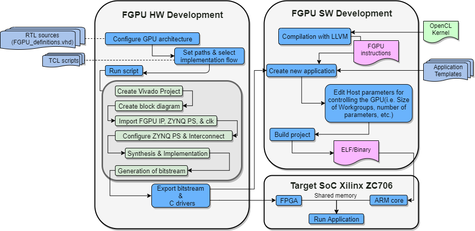

FGPU is a soft GPU-like architecture for FPGAs. It is described in VHDL, fully customizable, and can be programmed using OpenCL.

FGPU is currently being developed and maintained by the [Chair of Computer Engineering at the Brandenburg University of Technology Cottbus-Senftenberg], in Germany. It was [originally developed](https://github.com/malkadi/FGPU) by Muhammed Al Kadi from the [Ruhr University Bochum], in Germany.

[Chair of Computer Engineering at the Brandenburg University of Technology Cottbus-Senftenberg]: https://www.b-tu.de/en/computer-engineering-group
[Ruhr University Bochum]: https://www.ei.ruhr-uni-bochum.de/fakultaet/

# Contents and Structure of the FGPU Repository

This repository contains the following resources:
- **An RTL description of the FGPU architecture**, in VHDL, which can be used for behavioral simulation and FPGA-targeted implementation -- see the [RTL](rtl/) folder.
- **An LLVM-based FGPU compiler** -- see the the [compiler](compiler/) folder.
- **Files for running behavioral simulation in Mentor ModelSim** -- see the [project_modelsim](project_modelsim/) folder.
- **Files for setting up simulation and implementation projects in Xilinx Vivado**. In the current version, only the [Zynq-7000 ZC706] board is supported -- see the [project_vivado](project_vivado/) folder.
- **Pre-generated bitstreams** to quickly test FGPU applications in the [Zynq-7000 ZC706], skipping the HW generation step -- see the [bitstreams](bitstreams/) folder.
- **Examples of OpenCL kernels** for execution in the FGPU -- see the [kernels](kernels/) folder.
- **Examples of complete benchmarks** for execution in an ARM+FGPU processing system configured using the Vivado SDK -- see the [benchmark](benchmark/) folder.

# FGPU Quick Start

The following figure illustrates the HW and SW flow for setting up the FGPU hardware and compiling applications.

## Setting up the FGPU LLVM-based compiler

The LLVM-based compiler will be used to generate, from an OpenCL kernel description, the binaries containing the FGPU instructions that implement the kernel. To ensure portability, the FGPU compiler is built inside a Docker container. See the instructions in see the [compiler README](compiler/README.md).

## Setting up the Vivado SW/HW Development Environment

The Xilinx Vivado platform will be used to generate the hardware implementation from the set of RTL files, and also necessary libraries for communicating the main processing system (an ARM core, in case of the [Zynq-7000 ZC706] board). These libraries must be linked with the binaries generated in the compilation stage to enable the processing system to send commands and receive results from the FGPU. Detailed instructions for this process can be found in the [README for the Vivado flow](project_vivado/README.md).

# Limitations

## Supported Platforms / Tools

- The current version of the repository has been tested in both Windows and Linux.
- The implementation was tested in Xilinx Vivado v2016.2 and v2017.2, but only a 1CU with atomic implementation version is working on the v2017.2
- The simulation was tested in Mentor ModelSim 2020.1
- The VHDL code uses some VHDL-2008 constructs, which may be unsupported in some tools.
- Only the [Zynq-7000 ZC706] and the [ZedBoard] boards are currently supported.
    - We are currently working on extending the support for other boards.
- Only limited testing has been done with changing the the FGPU hardware parameters (size etc.). The current settings in `fgpu_definitions.vhd` have worked in the implementation and simulation flows.  

## Known Bugs

### Hardware
- Branch in a conditional procedure call is not working.  In other words, if a branch took place, then a function is called, whose code will branch, a problem will occurr. 
    - Reason: A branch writes the current top entry of the diveergence stack(in CU schedulre) and will create a new entry on the top. But the overwritten entry is needed when the function returns.
    - Solution: When a function is to be called, the wavefront active record (which referes to the top of divergence stack) needs to be incrmeneted. Have a look to the defined but commented PC_stack_dummy_entry in CU_scheduler.vhd.
    - How to regenerate: Use the LUdecompose kernel. Make a soft floating point operation in some if. You need data without NaN of inf.
- When the buswidth of read data from cache to CUs is smaller than the #CUs * 32bit, they may be some problems. The BRAM which stores read data from the cache in each CU may be overfilled and overwritten.
- Changing the address of atomic operation within the same kernel has never been tested. Application is needed.
- Setting the number of cache banks equal or less to the number of the AXI interface banks (CACHE_N_BANKS_W &lt= GMEM_N_BANKS_W) may lead to a bottleneck

### Software / Compiler
- Using other sections rather that .text is not yet supported.
    - How to generate: Define the coeffecients of a 5x5 image filter as a 2D array constant. This data will be stored into .rodata section.

[Zynq-7000 ZC706]: https://www.xilinx.com/products/boards-and-kits/ek-z7-zc706-g.html
[ZedBoard]: http://zedboard.org/product/zedboard
